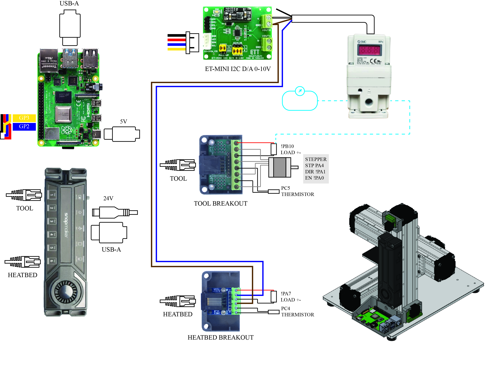

# SnapMaker-Klipper-Tool-Interface

This project documents the modification of the original Snapmaker platform to run Klipper firmware. The aim is to provide an open and reproducible reference for converting the Snapmaker machine into a flexible Klipper-controlled motion platform for experimental tool development, 3D printing, and hardware research.

The repository provides the Klipper configuration file, CAD model, connection information, wiring diagram, connector pinout, and technical references required to understand and reproduce the modification. The project focuses on how Klipper interacts with the Snapmaker hardware through stepper motor control, input/output pins, temperature sensing, auxiliary outputs, and custom G-code macros.

# Snapmaker Klipper
Modifying the Snapmaker platform to run Klipper firmware provides both technical challenges and significant benefits. The main challenges involve identifying and mapping the original hardware connections, including stepper motors, endstops, temperature sensors, auxiliary output pins, power-control signals, and tool connector pins. These connections must be carefully verified to avoid motor misdirection, unsafe homing, overheating, or damage to the controller and custom tools. Custom tool integration also requires careful coordination between the wiring diagram, connector pinout, CAD design, and Klipper .cfg file so that the physical hardware behavior matches the firmware commands. In addition, safe motion limits, homing sequences, emergency stop behavior, temperature readings, and output-pin activation must be tested before operation. Despite these challenges, the modification offers strong benefits by transforming the Snapmaker from a predefined fabrication machine into an open and flexible motion-control platform. Klipper allows users to modify machine behavior through editable configuration files, use advanced features such as input shaping, bed mesh compensation, firmware retraction, custom G-code macros, and web-based control through Mainsail. The documented tool connector and CAD model also allow users to design and interface their own tools, such as pneumatic dispensers, sensors, probing devices, actuators, or other experimental end-effectors. Overall, the modification increases the educational, research, and development value of the Snapmaker by turning it into a programmable platform for custom digital fabrication and tool-development experiments.

# Configuration file (.cfg)
This section provides the Klipper configuration file for the modified Snapmaker platform. The configuration defines the essential machine parameters required to operate the system with Klipper, including MCU communication, Cartesian motion settings, stepper motor pin assignments, endstop inputs, auxiliary output pins, temperature sensing, bed mesh settings, input shaping, firmware retraction, the homing sequence, and custom G-code macros.

The configuration is designed for the original Snapmaker machine running Klipper through a USB serial connection. The MCU communicates at a baud rate of 115200, and the virtual SD card path is configured for use with Mainsail. The configuration has been tuned for the existing modified hardware setup.

This configuration also demonstrates how the Snapmaker tool connector can be used to control a stepper motor, a load output, and temperature sensing. In addition, it includes an example of using a Python interface from Klipper to control external hardware, such as a DAC-based pressure-control system.

The example Klipper configuration demonstrates four main types of tool interfaces:
1. Load Control
   A digital output pin is used to switch an external load on or off, such as a solenoid valve, relay, LED, pump, or other actuator.
2. Stepper Control
   A manual stepper motor is configured for controlling a custom tool mechanism, such as a syringe pump, plunger, rotary tool, or material-feeding mechanism.
3. Thermistor / Temperature Sensing
   A thermistor input is configured to measure the temperature of the tool. This allows Klipper to monitor tool temperature for heated tools, process monitoring, or safety checking.
4. External Interface through I2C
   An external Python interface is demonstrated for communicating with an I2C device, such as the GP8403 DAC. This allows Klipper to control external hardware, for example pressure control, analog voltage output, pneumatic control, or other custom tool functions.

* [GP8403 Python Script](script/gp8403.py)
* [Python Pressure Control Script](script/pressure.py)

# CAD model
The tool design is provided as a Fusion 360 CAD model in .f3d format, allowing users to inspect, modify, and adapt the mechanical design for their own Snapmaker Klipper modification setup.
* [CAD](cad/Snapmaker klipper.f3z)

# Wiring and Connector
This section provides the wiring diagram and connector information for the Snapmaker Klipper modification. The wiring diagram shows how the Klipper firmware interacts with the input and output pins of the controller board, including stepper motor signals, endstop inputs, temperature sensor inputs, auxiliary outputs, and power-control signals.

The tool connector information is provided to support custom tool development. It allows users to interface their own tool designs with the Snapmaker hardware by identifying the available electrical connections, signal pins, power lines, and sensor inputs. This section is intended to help users understand the relationship between the Klipper configuration file, the physical wiring, and the actual hardware behavior.

The wiring and connector documentation should be used together with the .cfg file to verify pin assignments before powering or operating the machine.

| Function        | MCU Pin | Notes |
|-----------------|---------|-------|
| Step            | PA4     | Step signal |
| Direction       | PA1     | Direction signal |
| Enable          | PA0     | Active low |
| Heater (Hot end)         | PB10    | Hotend heater MOSFET |
| Thermistor (Nozzle)      | PC5     | ATC Semitec 104GT-2 |
| Heater          | PA7     | Bed heater MOSFET |
| Thermistor (Heater)      | PC4     | EPCOS 100K B57560G104F |

# Data sheet
* [ISE40-T1-22L Datasheet](https://www.smcpneumatics.com/pdfs/ISE40_ZSE40.pdf)
* [SYJ512M-5MZ-M5-F Datasheet](https://www.smcpneumatics.com/pdfs/SYJ_3PT.pdf)
* [SMC ITV Manual](https://www.smc.com.cn/upfiles/etc/international/imm/ITV2-TF2Z205EN.pdf)
* [SMC ITV Datasheet](https://www.smcworld.com/upfiles/manual/en-jp/files/DIU-60D00-OM002.pdf)
* [SMC CDUJB10-15D Datasheet](https://content.smcetech.com/pdf/CUJ_EU.pdf)
* [ET-MINI I2C D/A 0-10V TH Manual](https://www.etteam.com/prodintf/ET-MINI-I2C-DA-10V/th-man-ET-MINI-I2C-DA-10V.pdf)
* [Solenoid Valve SY3000 Datasheet](https://www.smcworld.com/upfiles/_manual/e/SY3000x-OMJ0003.pdf)

# References
1. Snapmaker Klipper by Ninth2234 : https://github.com/Ninth2234/snapmaker_klipper
2. open-interface-pressure-controller by schaiwuth : https://github.com/schaiwuth/open-interface-pressure-controller
3. Pico-Pneumatic-Valve by Ninth2234 : https://github.com/Ninth2234/Pico-Pneumatic-Valve
